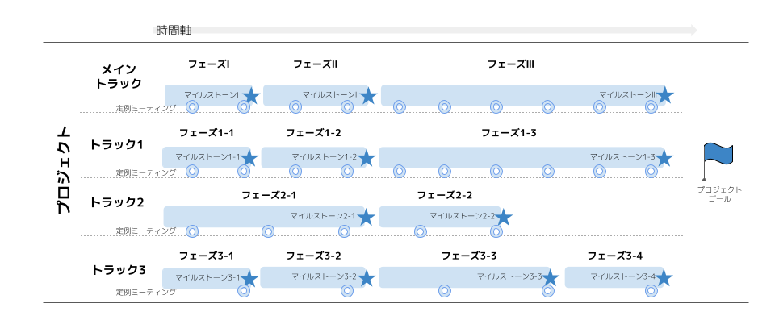

# トラックの設定方法

## 1. プロジェクトゴールに対する認識を揃える

[プロジェクトゴールとマイルストーンを設定する](section2-1.md)や、[プロジェクトゴールやマイルストーンの設定が難しいときの始め方](section2-1-1.md)を参考に、まずはプロジェクトの目的やプロジェクトゴールを明確化し、チームメンバー間での共通認識にします。

## 2. メインのトラックを設定する

プロジェクト全体・プロジェクトチーム全体の主な状態を把握するトラックを、メインのトラックとして設定します。このトラックには、プロジェクトゴールの達成のために必要な大きなマイルストーンと、プロジェクト全体に関わるアイデアの共創や問題の共同解決のために必要な定例ミーティングの両方が入力されることが多いでしょう。プロジェクトメンバーによる定例ミーティングを設定し、このトラックだけでなくプロジェクト全体のマイルストーンマップを毎週確認できるようにしておきましょう。

メインのトラックにおけるマイルストーンとステップは、外部制約や主要なイベントなどに応じて設定していくのがふつうですが、そういったものが明確に存在しない場合は、3か月ごとなどの定期的なタイミングでステップを区切ってマイルストーンを設定します。たとえば何らかのサービスを立ち上げるようなプロジェクトであれば、各ステップごとに顧客に対して提供したい価値を記述するのもよいでしょう。

各ステップの終点となるマイルストーンの成果物・あるべき姿には、提供したい価値・バリューを、具体的な作成物や数値目標、達成したい状態などに落とし込んで記載しましょう。メインのトラックのマイルストーンは、このあと設定される各トラックにおけるマイルストーン達成の集積によって達成されてゆくという構造になります。そのため、メインのトラックのマイルストーンを参照することで、このあと作成する各トラックのメンバーが自律的に各トラックのマイルストーンを決定できるような内容が書いてあることが望ましいです。

メインのトラックのマイルストーンを設定するときには、「各トラックの成果物の仕上がりが合わさる、または仕上がりを合わせたい具体的なタイミングはいつか」というところから考えてみるとイメージしやすくなるかもしれません。

## 3. メインのトラックの他に必要なトラックを設定する

メインのトラックのマイルストーンを達成するために必要なものを部分部分に分割して、その他のトラックを作っていきます。

基本的には、トラック同士は依存関係が少ない疎結合な状態になるように分割します。つまり、個々のトラックだけで自律して作業を進められるような分け方です。こういった分け方ができず、強い依存関係のあるタスクベースで進捗をコントロールする必要がある場合には、別途ガントチャートを作って把握するのがよいでしょう。

各トラックで個別にミーティングが必要な場合や、各トラックで個別にチームになった場合は定例ミーティングを置きますが、それぞれのトラックには必ずしも定例ミーティングを設定する必要はありません。

また、各トラックは原則として疎結合なものとして存在しますが、進捗状況の共有やマイルストーンの詳細な確認などを目的として、トラック間での連携やトラックを横断したミーティングを置くこともあります。このときは、連携が必要となるトラックの上部構造として、連携用のミーティングを置くトラックを設定するとよいでしょう。
